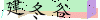

# captcha-break
captcha break based on opencv2, tesseract-ocr and some machine learning algorithm.
## Types
### [Basic](./basic)
  
The simplest captcha breaking.
### [CSDN](./csdn)
  
CAPTCHA from http://download.csdn.net/
### [SubMail](./submail)
   
CAPTCHA from http://submail.cn/sms
### [Weibo.cn](./weibo.cn)
  
CAPTCHA from http://login.weibo.cn/login/
### [Weibo.cn2](./weibo.cn2)
  
CAPTCHA from http://login.weibo.cn/login/
## License
MIT
