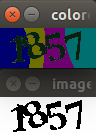

# JiKeXueYuan
CAPTCHA from http://passport.jikexueyuan.com/sso/login

## The Captcha image

## Result

## Enviorment
Programing Language: C++  
Library: opencv2 + libboost

## Status
half-finished. 

## Technique
use Expectation-maximization algorithm to split the data(the effect may be not good for some captcha), and you can use CNN to train the data set.

## Note
collecting dataset set is boring, this program only contains the spliter section.
