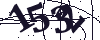
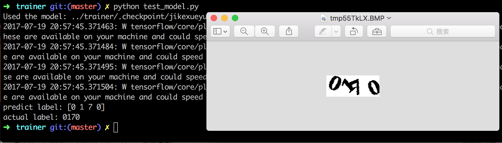

# JiKeXueYuan
CAPTCHA of http://passport.jikexueyuan.com/sso/verify

## The Captcha image


## Technique
Based on this post: [Number plate recognition with Tensorflow](http://matthewearl.github.io/2016/05/06/cnn-anpr/)

## Enviorment
Programing Language: Python2.7  
Library: Tensorflow-1.0 + pillow + scikit-learn-0.18

## Status
finished

## Steps
### 1.Train the model.
``` shell
cd trainer
python train.py
```
### 2.Test the model.
``` shell
cd trainer
python test_model.py
```


## About the Accuracy
After model trained, the accuracy for every character is about 90%, so the total accuracy is about 60%(0.9^4).

