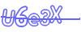
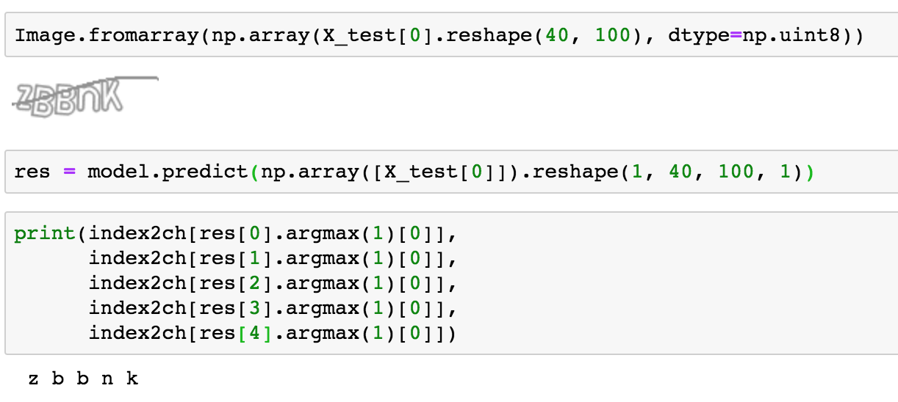
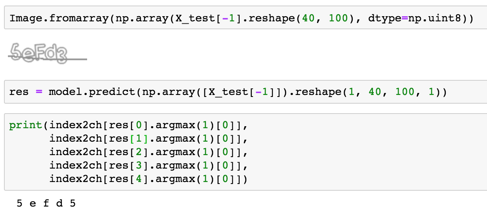
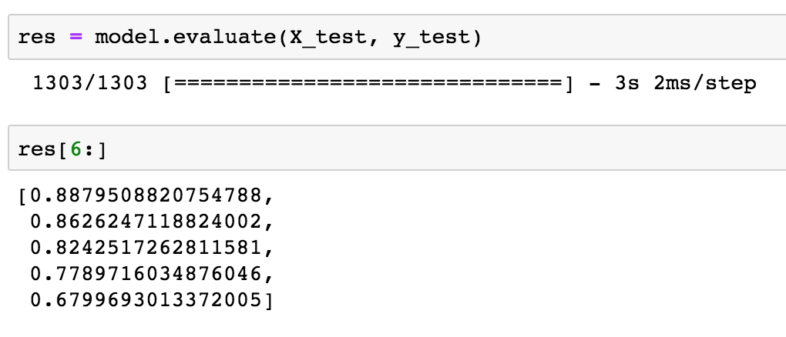

# Weibo.com
Captcha from [http://login.sina.com.cn/cgi/pin.php?r=8787878&s=0](http://login.sina.com.cn/cgi/pin.php?r=8787878&s=0)  


## The Captcha image


## Technique
The technique is same with [jikexueyuan](../jikexueyuan/python) captcha, but in real dataset.


## Enviorment
Programing Language: Python3.6   
Library: pillow + Tensorflow + Keras2

## Status
finished.

## Train Steps
Open the [weibo.com-process.ipynb](weibo.com-process.ipynb) in jupyter notebook.


## Use in product
Train the network, load weibo.com.h5 in Keras model, and use `model.predict` method to predict the result.
``` python
res = model.predict(np.array([X_test[0]]).reshape(1, 40, 100, 1))
print(index2ch[res[0].argmax(1)[0]],  # the first character
      index2ch[res[1].argmax(1)[0]],  # the second character
      index2ch[res[2].argmax(1)[0]],  # the third character
      index2ch[res[3].argmax(1)[0]],  # the forth character
      index2ch[res[4].argmax(1)[0]])  # the fifth character
```
### test1
<br>
### test2



## Accuracy
this captcha has 5 character, so there are 5 accurracies in the picture bellow.
